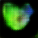

# gan

[](https://travis-ci.com/dlebech/gan)
[](https://codecov.io/gh/dlebech/gan)

Experiments with image generation using generative adversarial networks (GANs).

  

### Install dependencies

```shell
pip install -r requirements.txt
```

The requirement file has been reduced in size so if any of the scripts fail,
just install the missing packages :-)

### Get some data

You can create some toy data or download a dataset. For example, to create a bunch of shapes (useful for testing that things are working):

```shell
python -m gan.cli dataset shapes
```

Use `python -m gan.cli dataset -h` to see the options. Currently supports the following datasets:

- `shapes`: Shapes of random size, currently only ellipse shapes.
- `cartoon`: Cartoon avatars (see below).
- `coco`: [Common Objects in Context](https://cocodataset.org/). Currently only using the 2017 validation dataset (1GB download, 2.4GB unzipped), because it is limited in size.
  - This dataset also includes captions.

#### Cartoon dataset

To use the cartoon avatar dataset:

1. Download the dataset from here: https://google.github.io/cartoonset/download.html (Downloading this file via Python seems to not work).
2. Create a `data` directory (if it does not already exist). Note: You can put this data directory anywhere you like. The CLI expects a folder called `data`, but you can specify a different location with the CLI:
3. Put the downloaded file in your `data` directory with the name `cartoon.tgz`.
4. Run the command `python -m gan.cli dataset cartoon` which will take care of unzipping and organizing the contents of the cartoon dataset.

### Run the training

```shell
python -m gan.cli train -d data/shapes
```

This command by default takes care of all the training.

Check `python -m gan.cli train -h` for options.

#### Training on GPU

The requirements.txt file refers to the CPU version of Tensorflow but
manually uninstalling and installing the GPU version *might* work if you have
everything set up with CUDA and stuff.

Otherwise, the easiest way to get GPU support is to use Docker which only
requires the NVIDIA driver and toolkit. Instructions found
[here](https://www.tensorflow.org/install/docker).

Start bash inside the container:

```shell
docker build -t gan-gpu .
docker run --rm -it --gpus all -v $PWD:/tf/src -u $(id -u):$(id -g) gan-gpu bash
```

Then all the above CLI commands should work as-is.

## License

MIT License.

Parts of the code are modified from the [DCGAN Tensorflow tutorial](https://www.tensorflow.org/tutorials/generative/dcgan) with the [Apache License](https://github.com/tensorflow/docs/blob/master/LICENSE).
